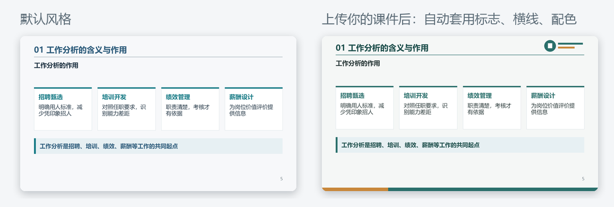

# Lecture PPT Workflow · Lecture notes to teaching slides

[简体中文](README.md) | **English**

Give your lecture notes to any AI chatbot and get an **editable** teaching deck in minutes: layouts are computed for you, every slide has **speaker notes**, case analyses and quiz answers **appear on click**, and the deck can reuse **your own institution's template**.

**[▶ Use it online (no install, no sign-up)](https://hhhmike240-maker.github.io/lecture-ppt-workflow/app/)** · [Sample deck](demo/lecture.pptx) · [Sample notes](demo/lecture.md) · [Feedback](https://github.com/hhhmike240-maker/lecture-ppt-workflow/issues/new/choose)


<sub>Six of the 15 slides generated from the sample notes (a Chinese HR-management chapter), with no manual edits. Every text box, table and shape is editable in PowerPoint or WPS.</sub>

## Three steps

1. Open the **[web page](https://hhhmike240-maker.github.io/lecture-ppt-workflow/app/)** and copy the prompt (choose "English prompt"; the page itself is in Chinese).
2. Send the prompt and your notes to an AI chatbot: ChatGPT, Claude, DeepSeek, Kimi, Doubao, Qwen and others all work.
3. Paste the answer back into the page, check the preview, and download the PPTX.

Optional: upload one of your existing decks. The new deck reuses its **logos, title rule, colors and fonts**.



Your notes and slides are processed **in your browser only**. The only network traffic is your own conversation with the AI.

## What makes it different

The rules come from several rounds of feedback from a university instructor who taught with the generated decks.

| What teachers care about | What this tool does |
|---|---|
| No invented content | The prompt keeps the AI faithful to your notes; additions go into speaker notes marked "please verify"; invented cases are labeled fictional |
| Something to say | Every slide gets speaker notes: key points, common misconceptions, a question to ask, the transition |
| Class interaction | Case analyses and quiz answers are hidden until you click (native PowerPoint animation) |
| Readable slides | Text limits per slide; overflow is reported with "split this slide", **never silently shrunk** |
| Your own template | Upload a deck; logos, rules, color bands and fonts are reused |
| Original figures | Figures from your notes are not redrawn by the AI; a placeholder marks where to insert them |
| Fully editable | Native text boxes, tables and shapes, no page screenshots |

## 13 teaching layouts

Cover · Agenda · Section · Key points (auto cards) · Definition · Comparison · Table · Process · Case (click to reveal analysis) · Figure · Quiz (click to reveal answers) · Knowledge map · Closing.

The AI writes content and picks layouts; positions, spacing and alignment are computed. See the [outline format](lecture-ppt-workflow/references/outline.md).

## Advanced use

### As a skill in coding agents (Codex / Claude Code)

```bash
git clone https://github.com/hhhmike240-maker/lecture-ppt-workflow.git
cd lecture-ppt-workflow
python install.py --target claude      # Claude Code: ~/.claude/skills
python install.py --target codex       # Codex: ~/.codex/skills
```

Then ask: "Use the lecture-ppt-workflow skill to turn lecture.docx into slides with my reference deck's style." The agent indexes the Word/PPT files, writes the outline, builds and renders the deck, and checks that each knowledge point appears on screen. Requires Python 3.10+ and Node.js 20+; the installer prints the `npm ci` step. See the [quick start](docs/QUICKSTART.en.md).

### Command line

```bash
cd lecture-ppt-workflow && npm ci --ignore-scripts && cd ..
node lecture-ppt-workflow/scripts/build_outline.mjs demo/outline.json out/demo --template my-deck.pptx
```

The output folder contains `lecture.pptx`, a layout report `report.json`, the page specification `spec.json`, and a copy of `outline.json` for later edits or restyling. Existing folders are never overwritten. For the full demo with coverage checks and previews, run `python demo/run_demo.py --out out/full-demo`.

## Verified and not yet verified

- **Verified** (2026-10-07, Windows with Microsoft 365 PowerPoint): opening and exporting all 15 sample slides; click animations recognized by PowerPoint as on-click fade, 0.4 s; identical output from the web page and the command line; template reuse on an original sample template and on a real university template; **WPS Office (Windows)** opens and exports the same pages and recognizes the click animations. Automated tests: 32 Node, 19 Python. See the [validation log](docs/VALIDATION_20261007.md).
- **Not yet verified**: live slideshow playback in WPS (animation structure is recognized), PowerPoint for Mac, Keynote; rendering scripts on non-Windows systems; real-world quality for English-language courses. Feedback is welcome.

## Limits

- AI-written content needs the teacher's review.
- The web preview is approximate; PowerPoint or WPS is authoritative.
- Template reuse copies decorations **without text** (logo images, lines, color blocks). Placeholder styles, master text and inherited font sizes are not copied; preview complex templates first.
- No equations, charts, audio or video yet. Original figures are inserted by the teacher, or uploaded on the web page.

## Contributing and license

Feedback of any kind is welcome via [issues](https://github.com/hhhmike240-maker/lecture-ppt-workflow/issues/new/choose). See [CONTRIBUTING](CONTRIBUTING.md) for adding layouts or improving prompts. Original code, rules, docs and samples are [MIT licensed](LICENSE). The generation engine is [PptxGenJS](https://github.com/gitbrent/PptxGenJS) (MIT); see [NOTICE](NOTICE) and [provenance](docs/PROVENANCE.md). Built with AI assistance; requirements, teacher feedback and acceptance by the maintainer.
