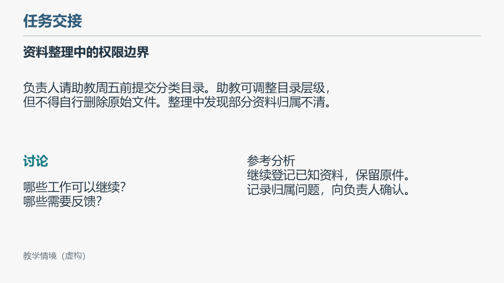
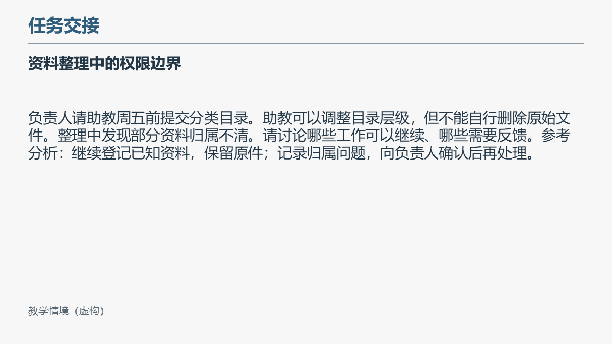

# 教学课件工作流 · GitHub 早期试用版 v0.1.0-alpha

教师讲义与标准课件输入 → 知识课件 → 教师反馈修订 → 后续章节复用。

适合希望保留课程知识、版式与授课备注，并能审核结果的教师、助教。项目是Codex Skill、规则和辅助脚本，不是独立大模型、通用演示软件或无人审核的教学系统。

**当前版本已发布在 GitHub，定位为源代码与示例的早期试用版。** 它需要Node、公开npm依赖、中文字体和演示软件；安装器不会自动下载依赖。详细事实见[运行与许可](lecture-ppt-workflow/references/runtime.md)和[验证记录](docs/VALIDATION.md)。

维护者上传步骤见[上传清单](docs/UPLOAD_CHECKLIST.md)，仓库与Release文案见[发布草稿](docs/GITHUB_DRAFT.md)。v0.1.0-alpha 已作为早期试用版公开发布。

## 功能与证据

| 能力 | 实现与边界 |
|---|---|
| 新章、情境增强、限定修订、样式提取 | Skill路由与规则，依赖模型判断，不是四个全自动命令 |
| Word/PPT索引、图片与备注定位 | Python脚本；图片语义仍需读图 |
| 可编辑文字、形状、表格、关系连线 | JSON规格生成器；使用公开PptxGenJS依赖，不自动理解Word |
| 点击淡入与授课备注 | 原生结构，新增指定页；不重建既有复杂动画 |
| 内容覆盖与样式检查 | ID/关键词/坐标策略，不证明语义正确或页面美观 |
| 背景限定修订 | 仅直接纯色背景；主题/图片背景需单独判断 |
| 静态预览 | 需要PowerPoint，或LibreOffice与Poppler；不等同实际放映 |

不适用：大量公式或复杂音视频保真转换、自动判断学校素材授权、完全离线智能排版、保证所有PowerPoint/WPS版本兼容。

已有一位教师独立制作后续章节，经过数轮反馈修订后表示效果较好。依据项目发起人提供的实际反馈，未公开私人对话和课件；不能推导为零修改成功、量化节省时间或跨设备验证。

## 安装与环境

1. Python 3.10+。解析和检查使用标准库；动画另需lxml（本机测试版本见验证记录）。不要向托管运行时全局装依赖。
2. 生成需要Node 20+和公开npm依赖。在`lecture-ppt-workflow`目录运行`npm ci --ignore-scripts`即可安装PptxGenJS 4.0.1；本项目不提交`node_modules`。静态渲染可使用LibreOffice + Poppler，Windows也可运行`render_windows.ps1`。
3. 中文字体需自行合法安装。样例选择Microsoft YaHei，字体不随包附送；其他字体须重新渲染。
4. 实际放映需用户的演示软件。本机PowerPoint结果不外推到WPS/macOS/Linux。

在本目录运行：

```text
python install.py
```

默认安装到`CODEX_HOME/skills`，未设置时为用户目录下`.codex/skills`。独立名称为`lecture-ppt-workflow`，不会覆盖导师的`bupt-public-hrm-ppt-skill`。已有同名目录会拒绝覆盖。新任务中输入`$lecture-ppt-workflow`，确认实际被发现；目录复制成功不代表App发现已验证。

隔离安装（不改正式Skill目录）：

```text
python install.py --skills-dir scratch/skills
python scratch/skills/lecture-ppt-workflow/scripts/validate_skill.py
```

## 最短检查示例（无需生成引擎）

```text
python lecture-ppt-workflow/scripts/office_audit.py index demo/after.pptx --out scratch/index.json
python lecture-ppt-workflow/scripts/style_check.py demo/after.pptx --out scratch/style.json
```

全部输出用新路径，重复执行换目录。检查现成PPT不会触发AI写作。

## 最短生成示例

先安装公开依赖并准备实际Node、Python和字体；不要复制私有运行时。

```text
python -m pip install -r scratch/skills/lecture-ppt-workflow/requirements.txt
npm ci --ignore-scripts --prefix scratch/skills/lecture-ppt-workflow
python scratch/skills/lecture-ppt-workflow/scripts/doctor.py --out scratch/environment.json
python demo/run_demo.py --out scratch/demo-run --skill-dir scratch/skills/lecture-ppt-workflow
```

`run_demo.py`复现已审定的规格，不是独立AI任务，也不是“Word自动转PPT”。默认使用当前Python和PATH里的Node；`--node`可指定已解析Node。输出包含标准模板、修改前后课件、动画、PNG和检查结果。运行约需几十秒至数分钟，缺依赖明确失败，不删除失败产物。

## 教师使用流程

提供章节讲义、自己的标准PPT和本次范围。先检查环境；再读全文及原图、列知识映射、按标准建页、写备注和点击动画；最后逐页看图并交付新文件。反馈改动应说明页码/对象/目标，不覆盖上一版。

课程配置见[示例](lecture-ppt-workflow/course-profile.example.json)与[说明](lecture-ppt-workflow/references/course-profile.md)。配置是模型读取的偏好，不会自动驱动生成器；学校背景、Logo、字号与标题层数不写入通用默认。

完整可复制提示词见[demo/PROMPTS.md](demo/PROMPTS.md)。日常步骤见[使用说明](docs/USAGE.md)。

## 最小演示与反馈

自编短讲义：[任务交接](demo/lecture.md)。[标准模板](demo/standard.pptx)、[修改前](demo/before.pptx)、[修改后](demo/after.pptx)。没有学校标识、教师原图或外部照片。



反馈样例：把密集的情境段落分成任务材料、明确问题和点击揭示的参考分析，同时保留知识和必要虚构标识。修改前后均是本项目自编演示，不冒称导师当时使用的原稿。



末页用真实知识分支图回顾。演示只说明最小工作流，不代表复杂课程质量。生成文件已随公开版适配器在本机完成静态审阅；公开发布时仍需使用者自行确认素材、字体和软件许可。

## 限制、问题报告与计划

- 当前限制：跨平台静态渲染需自行安装LibreOffice + Poppler；Windows PowerPoint渲染脚本未验证动态放映。复杂既有模板仍需使用者提供标准并人工审核。未来计划见[发布审阅](docs/RELEASE_REVIEW.md)。
- 公共候选Skill未在另一台电脑或独立Codex任务中验证触发。不能把本机隔离目录测试称为干净系统测试。
- 复杂模板、主题、继承字号、公式和动态放映需另测。自动检查不能替代教师知识审核。
- 用量没有固定承诺，文件大小不等于模型消耗。
- 更新请使用新目录；不要无确认删除缓存或旧成果。

报告问题请按[问题模板](docs/ISSUE_TEMPLATE.md)提供脱敏复现材料；不要上传学生信息、聊天记录、账号路径或未获许可课件。仓库已公开，欢迎通过 [Issues](https://github.com/hhhmike240-maker/lecture-ppt-workflow/issues) 提交反馈。

后续优先级：第二设备安装与独立任务触发 → 跨平台静态渲染 → 动态点击放映与复杂模板兼容性。暂不开发网站、账号或大型模板库。

## 版本、来源与许可

内部v1.1保留不动；公开v0.1.0-alpha为通用化分支，并非v1.1功能全部获得公开验证。见[CHANGELOG](CHANGELOG.md)。

本项目由需求方沟通、整理教师反馈并验收，代码及文档在AI辅助下实现。PptxGenJS等外部工具承担PPTX生成/渲染，本项目增加教学规则、边界、规格适配、检查与反馈复用。详见[来源和许可审查](docs/PROVENANCE.md)。

本仓库原创代码、规则、文档和原创演示材料按根目录 `LICENSE` 发布。第三方运行时、字体、PowerPoint、Python/Node及其依赖不受本许可证覆盖，使用者必须遵守各自许可。上传前仍应确认自己对新增素材拥有权利。
