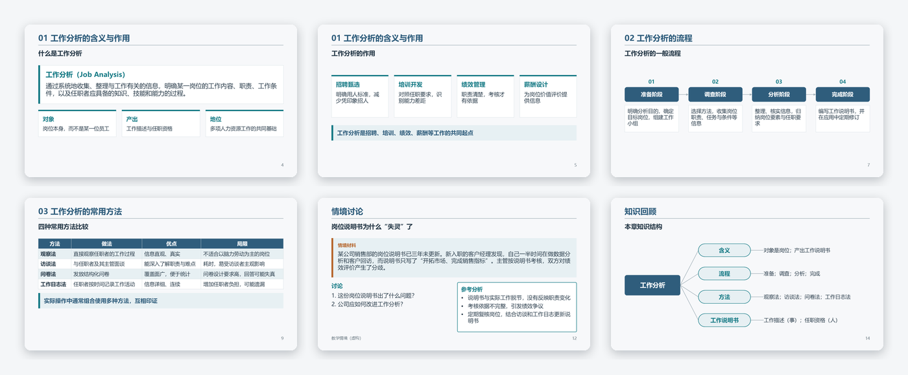

# Lecture PPT Workflow · 教学课件工作流 (Codex plugin)

Turn lecture notes into an **editable** teaching deck: computed layouts, **speaker notes** on every slide, case analyses and quiz answers that **appear on click**, and optional reuse of your own deck's logos, title rule, colors and fonts. Version 0.2.0. Source and the no-install web page: [hhhmike240-maker/lecture-ppt-workflow](https://github.com/hhhmike240-maker/lecture-ppt-workflow).



## Install

This folder is a plugin package for a Codex marketplace you control:

1. Put this whole folder at `plugins/lecture-ppt-workflow` in your repository.
2. Add an entry to that repository's `.agents/plugins/marketplace.json` with name `lecture-ppt-workflow` and local source `./plugins/lecture-ppt-workflow`, keeping existing entries.
3. Install it from the marketplace in the Codex app, then open a new task and confirm the skill is available.

Simpler alternatives: run `python install.py --target codex --with-deps` from the source repository, or use the web page without installing anything.

Install the generation dependencies once (Node.js 20+), from this plugin's root:

```sh
npm ci --ignore-scripts --prefix skills/lecture-ppt-workflow
```

Python 3.10+ is used for indexing Word/PPT files and checks; `lxml` is only needed to animate existing decks.

## First task

> Use the lecture-ppt-workflow skill to turn my notes into an editable teaching deck in the style of my reference PPT. Render and check every slide, and tell me what I should verify.

Try it on the sample: [lecture notes](assets/demo/lecture.md) and [sample template](assets/demo/template/sample-template.pptx). More requests: [English](assets/demo/PROMPTS.en.md), [中文](assets/demo/PROMPTS.md).

## 中文说明

把讲义做成**可编辑**的教学课件：版式自动计算，每页有**授课备注**，案例分析和提问答案**点击出现**，可套用你自己课件的标志、横线、配色和字体。安装后新建任务，说“用 lecture-ppt-workflow 把这份讲义做成课件”即可。首次使用前在插件根目录运行上面的 `npm ci` 命令。不想安装的话，可以使用仓库首页的在线页面。

## Limits

Teachers review content and the final deck. Template reuse copies text-free decorations only (logo images, lines, color blocks); placeholder styles and master text are not copied. Verified on Windows with Microsoft 365 PowerPoint; WPS and Mac have not been verified. See the [validation log](assets/docs/VALIDATION_20261007.md), [FAQ](assets/docs/FAQ.md) and [provenance](assets/docs/PROVENANCE.md). Original files are [MIT licensed](assets/LICENSE); third-party components are listed in [NOTICE](assets/NOTICE).
