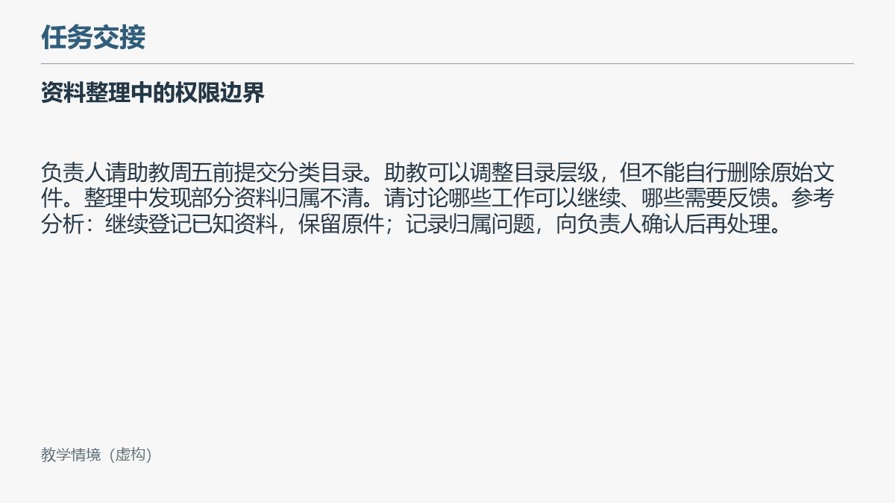

> **Source-repository guide.** The commands and prompt paths below assume a checkout of the [source repository](https://github.com/hhhmike240-maker/lecture-ppt-workflow), not the extracted plugin root or assets directory. Paths such as `install.py`, `demo/`, and `.agents/skills/` belong to that repository setup. For this plugin package, follow the [plugin README](../README.md) instead: its Skill is under `skills/lecture-ppt-workflow`, its example inputs are under `assets/demo`, and discovery must use the actual installed plugin location. This is the 0.1.1-alpha early-access package.

> **源代码仓库指南。** 下方命令和提示词路径以完整源代码仓库为起点，不能直接在插件根目录执行。插件包请按上方插件说明操作：示例在 `assets/demo`，Skill 在 `skills/lecture-ppt-workflow`，应用发现需确认真实安装位置。本包为 0.1.1-alpha 早期试用包。

# Lecture PPT Workflow

**Turn lecture notes and a reference deck into editable teaching slides, then refine them through instructor feedback.**

[中文](../README.md) · English · [Quick start](docs/QUICKSTART.en.md) · [Example prompts](demo/PROMPTS.en.md) · [Report an issue](https://github.com/hhhmike240-maker/lecture-ppt-workflow/issues/new/choose)

These documents describe **v0.1.1-alpha**. Download published packages from [Releases](https://github.com/hhhmike240-maker/lecture-ppt-workflow/releases). [Watch the 60-second English-captioned overview](docs/media/lecture-ppt-workflow-overview.mp4): a walkthrough made from original Chinese slide images, not a screen recording.

Lecture PPT Workflow is a Codex Skill with teaching rules and supporting scripts for instructors and teaching assistants. Bring your chapter notes and a reference PowerPoint deck; the workflow guides content mapping, slide creation, speaker notes, review, and reuse in later chapters.

**This is an early alpha workflow.** It requires Codex, a model, and the tools needed for your task. The installer copies the Skill; it does not install dependencies. English onboarding is available here, while the detailed Skill rules and reference documents remain primarily in Chinese. The included slides are Chinese-language examples; complete English slide output has not yet been validated.

## What you can do

| Task | What the workflow supports | What still needs review |
|---|---|---|
| Build a chapter deck | Map lecture content and original figures to slides; create editable text, shapes, tables, and relationship diagrams | The model interprets the sources; the instructor checks meaning and completeness |
| Add teaching scenarios | Keep the knowledge sequence intact, add supplied scenarios, and reveal reference analysis on click | Sources, fictional labels, teaching fit, and actual slideshow behavior |
| Make a focused revision | Specify a slide, object, or limited change and deliver a new file | Complex templates and inherited styles may need extra work |
| Extract a course style | Identify layout and font roles from a reference deck and suggest a reusable course profile | The profile is guidance for the model, not an automatic renderer configuration |

The supporting scripts index DOCX/PPTX files, locate images and notes, generate new slides from reviewed JSON specifications using PptxGenJS, and check package structure, content identifiers, and geometry. These checks help review a deck; they do not establish semantic correctness or visual quality.

## See the example

The original, fictional example teaches a short task-handover framework. It includes [lecture notes in Chinese](demo/lecture.md), a [reference deck](demo/standard.pptx), and editable [before](demo/before.pptx) and [after](demo/after.pptx) decks.

**After revision — Chinese-language demo, slide 2.** Materials, discussion, and reference analysis occupy separate regions. The analysis has a click-to-reveal animation in the PPTX; the static image cannot demonstrate playback.


**Before revision — Chinese-language demo, slide 2.** The same example begins as a denser scenario page.



These are project-authored demonstration materials, not private instructor files. They contain no school branding or external photographs and illustrate a minimal workflow rather than the quality of an entire course.

## Try the smallest check

With Python 3.10+ available, run these commands from the repository root. They inspect the included PPTX without Codex, a model call, Node, or a generation engine:

```text
python lecture-ppt-workflow/scripts/office_audit.py index demo/after.pptx --out scratch/check-1/index.json
python lecture-ppt-workflow/scripts/style_check.py demo/after.pptx --out scratch/check-1/style.json
```

Read the JSON reports for errors and warnings. Choose a new output path when repeating a check; existing outputs are not overwritten. A successful check does not mean the deck has passed instructor review or slideshow testing.

## Use the Skill in Codex

For a project-scoped trial, install a separate copy inside this repository:

```text
python install.py --skills-dir .agents/skills
python .agents/skills/lecture-ppt-workflow/scripts/validate_skill.py
```

Open this repository as your Codex project and start a new task. Ask Codex to confirm that it discovered the Skill before proceeding:

```text
Use $lecture-ppt-workflow. First confirm that you can discover and read this
Skill, then check the available runtime, fonts, and rendering tools.
Use demo/lecture.md as the content source and demo/standard.pptx as the
visual reference. Create a three-slide Chinese teaching deck with speaker
notes, a final relationship diagram, and click-to-reveal scenario analysis.
Write a new file and inspect every rendered slide. Report structural checks,
static inspection, and actual slideshow testing separately.
```

This is an English-language instruction for the **Chinese demo**. See [example prompts](demo/PROMPTS.en.md) for revisions, style extraction, and an English-output trial.

The installer refuses an existing destination. Without `--skills-dir`, its current default is `$CODEX_HOME/skills`, or `~/.codex/skills` when `CODEX_HOME` is unset; the explicit project path above avoids relying on that default. Copying files and passing the structural validator do not prove Codex discovery or successful invocation.

For generation, prepare Python 3.10+, Node.js 20+, the locked npm dependencies, `lxml` in a dedicated Python virtual environment, suitable fonts, and a rendering tool. The demo uses Microsoft YaHei, which is not bundled. The demo runner uses PowerPoint on Windows and LibreOffice plus Poppler on other platforms. Follow the [quick start](docs/QUICKSTART.en.md) for exact commands and limitations.

## Evidence and current limits

See the [current validation record](docs/VALIDATION_20261004.md) and [release notes](docs/RELEASE_0.1.1-alpha.md) for the dependency fix, 35 passing tests, and complete local demo rerun.

The [validation record in Chinese](docs/VALIDATION.md) documents local installation checks, script tests, generation with PptxGenJS 4.0.1, and static PowerPoint exports of the reference, before, and after decks. The revised scenario slide contains one manual fade-in animation in the file structure. Actual click-through playback was not tested.

The project initiator reported that one instructor independently made a later chapter and was satisfied after several feedback rounds. This is feedback from the internal project context, not a published study or evidence from external users of this public package. No time-saving measurement, first-pass success rate, or cross-device result is claimed.

Known gaps include a fresh-device installation, discovery and invocation in an independent Codex task, the LibreOffice rendering path, complete English slide output, and actual slideshow playback. Complex templates, theme inheritance, formulas, multimedia, and PowerPoint/WPS compatibility need separate testing. Existing complex animations are not reconstructed. Teachers retain responsibility for subject accuracy and classroom suitability.

## Feedback, sources, and license

See the [bilingual FAQ](docs/FAQ.md). Feedback about successful installation, your own slides, and repeat use is welcome, as well as bug reports.

[Open an issue](https://github.com/hhhmike240-maker/lecture-ppt-workflow/issues/new/choose) with your operating system, tool versions, exact command or prompt, the observed result, and a small example you have permission to share. Remove student information, private conversations, local account paths, and restricted course materials first.

The code and documents were created with AI assistance; existing tools such as PptxGenJS perform PPTX generation. This project contributes the teaching workflow, constraints, specification adapter, checks, and feedback reuse. See [provenance](docs/PROVENANCE.md), [runtime and licensing notes](../skills/lecture-ppt-workflow/references/runtime.md), and the [changelog](CHANGELOG.md); these detailed documents are currently in Chinese.

Original project code, rules, documentation, and demo materials are released under the [MIT License](LICENSE). Third-party dependencies, fonts, and presentation software retain their own licenses. Keep original inputs and previous outputs; use new paths for revisions and updates.
