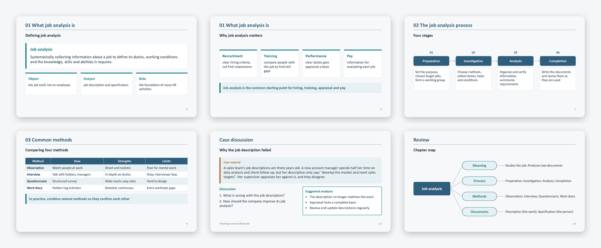

> **Source-repository guide.** The commands and prompt paths below assume a checkout of the [source repository](https://github.com/hhhmike240-maker/lecture-ppt-workflow), not the extracted plugin root or assets directory. Paths such as `install.py`, `demo/`, and `.agents/skills/` belong to that repository setup. For this plugin package, follow the [plugin README](../README.md) instead: its Skill is under `skills/lecture-ppt-workflow`, its example inputs are under `assets/demo`, and discovery must use the actual installed plugin location. This is the 0.2.0 package.

> **源代码仓库指南。** 下方命令和提示词路径以完整源代码仓库为起点，不能直接在插件根目录执行。插件包请按上方插件说明操作：示例在 `assets/demo`，Skill 在 `skills/lecture-ppt-workflow`，应用发现需确认真实安装位置。本包为 0.2.0 版。

# Lecture PPT Workflow · Lecture notes to teaching slides

[简体中文](../README.md) | **English**

Give your lecture notes to any AI chatbot and get an **editable** teaching deck in minutes: layouts are computed for you, every slide has **speaker notes**, case analyses and quiz answers **appear on click**, and the deck can reuse **your own institution's template**.

**[▶ Use it online (no install, no sign-up)](https://hhhmike240-maker.github.io/lecture-ppt-workflow/app/?lang=en)** · [Sample deck](demo/en/lecture.pptx) · [Sample notes](demo/en/lecture.md) · [Feedback](https://github.com/hhhmike240-maker/lecture-ppt-workflow/issues/new/choose)



<sub>Six of the 15 slides generated from the [sample notes "Chapter 3 Job Analysis"](demo/en/lecture.md), with no manual edits. Every text box, table and shape is editable in PowerPoint or WPS.</sub>

## Three steps

1. Open the **[web page](https://hhhmike240-maker.github.io/lecture-ppt-workflow/app/?lang=en)** and click "Copy prompt".
2. Send the prompt and your notes to an AI chatbot: ChatGPT, Claude, Gemini, Copilot, DeepSeek and others all work.
3. Paste the answer back into the page, check the preview, and click "Download PPTX".

Optional: upload one of your existing decks. The new deck reuses its **logos, title rule, colors and fonts**.


Your notes and slides are processed **in your browser only**. The only network traffic is your own conversation with the AI.

The page, the prompt, the slide labels ("Answer:", "Suggested analysis", the click order in the notes) and the layout messages all come in English and Chinese. The page follows your browser language; switch with the button in the top-right corner.

## What makes it different

The rules come from several rounds of feedback from a university instructor who taught with the generated decks. The goal is a deck you can **teach from**, not just one that looks nice.

| What teachers care about | What this tool does |
|---|---|
| No invented content | The prompt keeps the AI faithful to your notes; additions go into speaker notes marked "please verify"; invented cases are labeled fictional |
| Something to say | Every slide gets speaker notes: key points, common misconceptions, a question to ask, the transition |
| Class interaction | Case analyses and quiz answers are hidden until you click (native PowerPoint animation) |
| Readable slides | Text limits per slide; overflow is reported with the exact sentence to send the AI ("Slide 5 has too many points: split it into two slides…"), and text is **never silently shrunk** |
| Your own template | Upload a deck; logos, rules, color bands and fonts are reused |
| Original figures | Figures from your notes are not redrawn by the AI; a placeholder marks where to insert them |
| Fully editable | Native text boxes, tables and shapes, no page screenshots |

Where these rules come from: [rules learned from teacher feedback](../skills/lecture-ppt-workflow/references/feedback.md).

## 13 teaching layouts

Cover · Agenda · Section · Key points (auto cards) · Definition · Comparison · Table · Process · Case (click to reveal analysis) · Figure · Quiz (click to reveal answers) · Knowledge map · Closing.

The AI writes content and picks layouts; positions, spacing and alignment are computed, so every deck is tidy and consistent. See the [outline format](../skills/lecture-ppt-workflow/references/outline.md).

## Advanced use

### As a skill in coding agents (Codex / Claude Code)

```bash
git clone https://github.com/hhhmike240-maker/lecture-ppt-workflow.git
cd lecture-ppt-workflow
python install.py --target claude      # Claude Code: ~/.claude/skills
python install.py --target codex       # Codex: ~/.codex/skills
```

Then ask: "Use the lecture-ppt-workflow skill to turn lecture.docx into slides with my reference deck's style." The agent indexes the Word/PPT files, writes the outline, builds and renders the deck, and checks that each knowledge point appears on screen. Requires Python 3.10+ and Node.js 20+; the installer prints the `npm ci` step. See the [quick start](docs/QUICKSTART.en.md).

### Command line

```bash
cd lecture-ppt-workflow && npm ci --ignore-scripts && cd ..
node lecture-ppt-workflow/scripts/build_outline.mjs demo/en/outline.json out/demo --template my-deck.pptx
```

The output folder contains `lecture.pptx`, a layout report `report.json`, the page specification `spec.json`, and a copy of `outline.json` for later edits or restyling. Existing folders are never overwritten. For the full demo (Chinese and English decks, coverage checks and previews), run `python demo/run_demo.py --out out/full-demo`.

## Verified and not yet verified

- **Verified** (2026-10-07, Windows with Microsoft 365 PowerPoint): the 15-slide English sample opens and exports with no overlaps or truncation, with 3 click reveals and English labels and notes; the Chinese sample is unchanged from v0.2.0 (identical layout output). Click animations are recognized by PowerPoint as on-click fade, 0.4 s; the web page and command line produce the same output; template reuse was tested on an original sample template and a real university template; **WPS Office (Windows)** opens and exports the Chinese sample and recognizes the click animations. **Real Claude run with English notes** (claude.ai, English prompt + the English sample notes): the first answer was a valid 19-slide outline with no layout errors or warnings, speaker notes on every content slide and the invented case labeled fictional; all 19 slides render cleanly in PowerPoint. Real chatbot runs with Chinese notes: DeepSeek gave a valid 17-slide outline first time, with 2 overflowing slides correctly flagged and fixed after one follow-up; Doubao passed first time with no layout issues. Automated tests: 41 Node, 19 Python. See the [validation log](docs/VALIDATION_20261007.md).
- **Not yet verified**: ChatGPT, Gemini and other chatbots with English notes; English decks in WPS; live slideshow playback in WPS (animation structure is recognized); PowerPoint for Mac and Keynote; rendering scripts on non-Windows systems. English text widths are estimated from font metrics measured in a browser (Calibri, Arial and others), not from PowerPoint itself. Feedback is welcome.

## Limits

- AI-written content needs the teacher's review: facts, terms and whether cases suit your class are your call.
- The web preview is approximate; PowerPoint or WPS is authoritative.
- Template reuse copies decorations **without text** (logo images, lines, color blocks). Placeholder styles, master text and inherited font sizes are not copied; preview complex templates first.
- No equations, charts, audio or video yet. Original figures are inserted by the teacher, or uploaded on the web page.

## Contributing and license

- Tried it? Whether it worked or you got stuck, [leave feedback](https://github.com/hhhmike240-maker/lecture-ppt-workflow/issues/new/choose); no lecture notes or student information needed.
- To add layouts or improve the prompts, see [CONTRIBUTING](CONTRIBUTING.md).
- Original code, rules, docs and samples are [MIT licensed](LICENSE). The generation engine is [PptxGenJS](https://github.com/gitbrent/PptxGenJS) (MIT); see [NOTICE](NOTICE) and [provenance](docs/PROVENANCE.md). Built with AI assistance; requirements, teacher feedback and acceptance by the maintainer.
